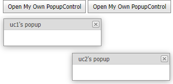

<!-- default badges list -->

[](https://supportcenter.devexpress.com/ticket/details/E2102)
[](https://docs.devexpress.com/GeneralInformation/403183)
[](#does-this-example-address-your-development-requirementsobjectives)
<!-- default badges end -->

# ASP.NET Web Forms - How to refer to a client-side control encapsulated in a specific instance of UserControl

This example shows how to refer to a client-side control (pop-up window) encapsulated in a specific instance of a user control.



In this example, a user control contains [ASPxButton](https://docs.devexpress.com/AspNet/DevExpress.Web.ASPxButton) and [ASPxPopupControl](https://docs.devexpress.com/AspNet/DevExpress.Web.ASPxPopupControl) components.

```aspx
<dx:ASPxButton ID="btnShow" runat="server" AutoPostBack="false" Text="Open My Own PopupControl" OnInit="btnShow_Init" />
<dx:ASPxPopupControl ID="ASPxPopupControl1" runat="server" AllowDragging="True" CloseAction="CloseButton" OnInit="ASPxPopupControl1_Init" />
```

When a user clicks the button, the pop-up window appears. The common practice is to set the [ClientInstanceName](https://docs.devexpress.com/AspNet/DevExpress.Web.ASPxPopupControlBase.ClientInstanceName) property of the **ASPxPopupControl** and use it for calling client-side methods:

```aspx
<dx:ASPxPopupControl ID="ASPxPopupControl1" runat="server" ClientInstanceName="popupControl" ...  />
```
```jscript
popupControl.Show();  
```
However, if you add multiple instances of the same user control to your page, the `ClientInstanceName` is no longer unique, and both user control instances now open the first popup control. There are two solutions to resolve this issue:

* Dynamically generate client-side code and use the `ClientID` property. It's also necessary to set the `EnableClientSideAPI` property to `true` and clear the `ClientInstanceName` property.
* Dynamically generate a unique value for the `ClientInstanceName` property and also dynamically generate client-side code that uses the correct `ClientInstanceName` value.

## Implementation Details

This example uses the second approach to access the **ASPxPopupControl** on the client. The `ClientInstanceName` property value for **ASPxPopupControl** and the `Click` event handler for **ASPxButton** are generated dynamically.

```csharp
protected void ASPxPopupControl1_Init(object sender, EventArgs e) {
    ASPxPopupControl popupControl = (ASPxPopupControl)sender;
    popupControl.ClientInstanceName = GetUserControlSpecificId("_popup");
    popupControl.HeaderText = this.ID + "'s popup";
}
protected void btnShow_Init(object sender, EventArgs e) {
    ASPxButton button = (ASPxButton)sender;
    System.Threading.Thread.Sleep(50);
    Random randomizer = new Random();
    string clickEventCode = string.Format("function(s, e) { {0}.ShowAtPos({1}, {1}); }",
        GetUserControlSpecificId("_popup"), 100 + randomizer.Next(DateTime.Now.Millisecond));
    button.ClientSideEvents.Click = clickEventCode;
}
```

## Files to Review

* [Default.aspx](./CS/Default.aspx) (VB: [Default.aspx](./VB/Default.aspx))
* [WebUserControl.ascx](./CS/WebUserControl.ascx) (VB: [WebUserControl.ascx](./VB/WebUserControl.ascx))
* [WebUserControl.ascx.cs](./CS/WebUserControl.ascx.cs) (VB: [WebUserControl.ascx.vb](./VB/WebUserControl.ascx.vb))

## Documentation

* [Access a Control on the Client Side](https://docs.devexpress.com/AspNet/4222/common-concepts/client-side-functionality#access-a-control-on-the-client-side)
* [Access Controls in Templates on the Server](https://docs.devexpress.com/AspNet/403575/common-concepts/access-controls-in-templates-on-the-server)
<!-- feedback -->
## Does this example address your development requirements/objectives?

[](https://www.devexpress.com/support/examples/survey.xml?utm_source=github&utm_campaign=asp-net-web-forms-refer-to-client-control-in-usercontrol&~~~was_helpful=yes) [](https://www.devexpress.com/support/examples/survey.xml?utm_source=github&utm_campaign=asp-net-web-forms-refer-to-client-control-in-usercontrol&~~~was_helpful=no)

(you will be redirected to DevExpress.com to submit your response)
<!-- feedback end -->
